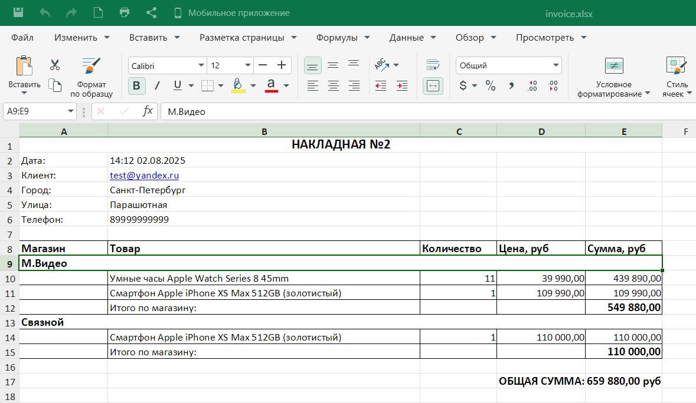
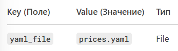
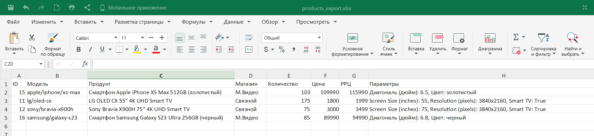
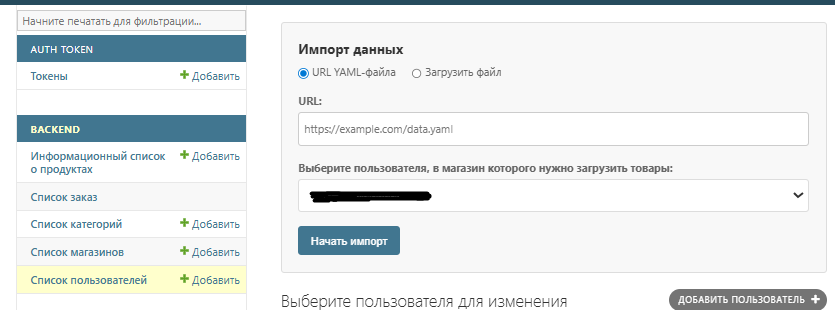

# Документация API для автоматизации закупок

# Описание сервиса

Сервис предоставляет возможность заказа товаров из нескольких магазинов.
Каталог товаров, информация о ценах и наличии загружаются из файлов
единого формата.

Пользователь собирает заказ (корзину), добавляя товары разных магазинов,
представленные в едином каталоге. Если один товар есть в наличии
в нескольких магазинах, можно выбрать какой из них добавить.
Так как цены в магазинах могут отличаться, это повлияет и на сумму
заказа.

После подтверждения заказа на странице подтверждения, заказ сохраняется
в базе со статусом "Новый".

В админке можно просмотреть все заказы и изменить их статус

При любом изменении статуса заказа, пользователю на email отправляется
уведомление об изменении.

## 👥 Роли пользователей
1. **Гость** (неавторизованный)
2. **Пользователь** (авторизованный)
3. **Владелец магазина**
4. **Администратор**

## Доступные действия для неавторизованного пользователя
### 1. Регистрация пользователя
```
POST http://example:8000/api/v1/user/register
Content-Type: application/json

{
    "first_name": "...",
    "last_name": "...",
    "email": "...",
    "password": "...",
    "company": "...",
    "position": "..."
}

```
**Успешный ответ**
```
201 Created
{
    "Status": true
}

```
После успешной регистрации пользователь получает email с токеном подтверждения.

Токен необходимо отправить обратно в API для завершения регистрации.

**Возможные ошибки**
```
400 Bad Request
{
    "Status": false,
    "Errors": {
        "email": [
            "Пользователь с таким email уже существует."
        ]
    }
}
```
### 2. Подтверждение email

```
POST http://example:8000/api/v1/user/register/confirm
Content-Type: application/json

{
    "email": "...",
    "token": "..."
}

```
**Успешный ответ**
```
200 OK
{
    "Status": true
}

```
**Возможные ошибки**
```
400 Bad Request
{
    "Status": false,
    "Errors": "Неправильно указан токен или email"
}
```
### 3.a Авторизация пользователя
```
POST http://example:8000/api/v1/user/login
Content-Type: application/json

{
    "email": "...",
    "password": "..."
}
```
**Успешный ответ**
```
200 OK
{
    "Status": true,
    "Token": "...."
}
```
**Возможные ошибки**
```
400 Bad Request
{
    "Status": false,
    "Errors": "Не удалось авторизовать"
}
```
### 3.b Авторизация пользователя через Яндекс
Шаги:
1) Пользователь переходит по URL авторизации
```
GET http://example:8000/social/complete/yandex-oauth2/
```

2) Система перенаправляет на страницу авторизации Яндекса
3) После успешного входа Яндекс возвращает пользователя обратно с параметрами:

```
http://ваш-домен/social/complete/yandex-oauth2/?state=...&code=...&cid=...
```
Успешный ответ:
```
{
  "status": "success",
  "user_id": 123,
  "email": "user@example.com",
  "token": "abc123...",
  "is_new_user": false
}
```

### 4. Запрос на сброс пароля
```
POST http://example:8000/api/v1/user/password_reset
Content-Type: application/json
{
    "email": "...",
}
```
**Успешный ответ**
```
200 OK
{
    "status": "OK"
}
```
После успешного запроса пользователь получает email с токеном для сброса пароля.

**Возможные ошибки**
```
400 Bad Request
{
    "email": [
        "Пользователь с таким email не найден. Попробуйте другой адрес электронной почты."
    ]
}
```
```
400 Bad Request
{
    "email": [
        "Введите правильный адрес электронной почты."
    ]
}
```
```
400 Bad Request
{
    "email": [
        "Обязательное поле."
    ]
}
```
### 5. Подтверждение сброса пароля
Вставить токен из пункта 4 и новый пароль
```
POST http://example:8000/api/v1/user/password_reset/confirm
Content-Type: application/json
{
    "password": "...",
    "token": "..."
}
```
**Успешный ответ**
```
200 OK
{
    "status": "OK"
}
```

**Возможные ошибки**
```
400 Bad Request
 {
    "password": [
        "Обязательное поле."
    ],
    "token": [
        "Обязательное поле."
    ]
}
```
```
400 Bad Request
{
    "password": [
        "Пароль должен содержать минимум 10 символов",
        "Введённый пароль слишком широко распространён.",
        "Введённый пароль состоит только из цифр."
    ]
}

```
```
400 Bad Request
{
    "password": [
        "Это поле не может быть пустым."
    ]
}
```
```
404 Not Found
{
    "detail": "Введённый одноразовый пароль недействителен. Проверьте и попробуйте снова."
}
```

### 6. Получение магазинов (только активных: state=True)
```
GET http://example.com:8000/api/v1/shops
Content-Type: application/json
```
**Успешный ответ**
```
200 OK
{
    "count": ...,
    "next": ...,
    "previous": ...,
    "results": [
        {
            "id": ...,
            "name": "...",
            "state": true
        }
        ...
    ]
}
```
### 7. Получение категорий
```
GET http://example.com:8000/api/v1/categories
Content-Type: application/json
```
**Успешный ответ**
```
200 OK
{
    "count": ...,
    "next": ...,
    "previous": ...,
    "results": [
        {
            "id": ...,
            "name": "..."
        },
        ...
    ]
}
```
### 8. Поиск товара
```
GET http://example.com:8000/api/v1/products?shop_id=...&category_id=...
Content-Type: application/json
```
**Успешный ответ**
```
200 OK
{
        "id": ...,
        "model": "...",
        "product": {
            "name": "...",
            "category": "..."
        },
        "shop": ...,
        "quantity": ...,
        "price": ...,
        "price_rrc": ...,
        "product_parameters": [
            {
                "parameter": "...",
                "value": "..."
            },
            ...
        ]
    },
    ...
```

## Доступные действия для авторизованного пользователя
### 1. Добавление контактов
```
POST http://example:8000/api/v1/user/contact
Authorization: Token ...
Content-Type: application/json
{
    "street": "...",
    "city": "...",
    "phone": "..."
}
```
**Успешный ответ**
```
201 Created
{
    "Status": true
}
```
**Возможные ошибки**
```
400 Bad Request
{
    "Status": false,
    "Errors": "Превышен лимит контактов (максимум 5)"
}
```
```
400 Bad Request
{
    "Status": false,
    "Errors": "Такой контакт уже существует"
}
```
### 2. Обновление контактов
```
PUT http://example:8000/api/v1/user/contact
Authorization: Token ...
Content-Type: application/json
{
    "id": "...",
    "house": ...
}
```
**Успешный ответ**
```
200 OK
{
    "Status": true
}
```
**Возможные ошибки**
```
400 Bad Request
{
    "Status": false,
    "Errors": "Необходимо указать хотя бы: city, street, house, structure, building, apartment или phone"
}
```
### 3. Получение контактов
```
GET http://example:8000/api/v1/user/contact
Authorization: Token ...
Content-Type: application/json
```
**Успешный ответ**
```
200 OK
[
    {
        "id": ...,
        "city": "...",
        "street": "...",
        "house": "...",
        "structure": "...",
        "building": "...",
        "apartment": "...",
        "phone": "..."
    },
...
   ]
```
### 4. Удаление контактов
```
DELETE http://example:8000/api/v1/user/contact
Authorization: Token ...
Content-Type: application/json
{
    "items": "id1,id2,id3,..."
}
```
items - строка, содеражащая id контактов, которые нужно удалить (разделитель - запятая, пробелы не допускаются)

**Успешный ответ**
```
200 OK
{
    "Status": true,
    "Удалено объектов": ...
}
```
**Возможные ошибки**
```
404 Not Found
{
    "Status": false,
    "Error": "Контакты не найдены"
}
```
### 5. Получение данных пользователя
```
GET http://example:8000/api/v1/user/details
Authorization: Token ...
Content-Type: application/json
```
**Успешный ответ**
```
200 OK
{
    "id": ...,
    "first_name": "...",
    "last_name": "...",
    "email": "...",
    "company": "...",
    "position": "...",
    "contacts": [
        {
            "id": ...,
            "city": "...",
            "street": "...",
            "house": "...",
            "structure": "...",
            "building": "...",
            "apartment": "...",
            "phone": "..."
        },
        ...
    ]
}
```
### 6. Редактирование данных пользователя
Должно быть хотя бы одно поле
```
POST http://example:8000/api/v1/user/details
Authorization: Token ...
Content-Type: application/json
{
    "first_name": "...",
    "last_name": "...",
    "email": "...",
    "password": "...",
    "company": "...",
    "position": "..."
}
```
**Успешный ответ**
```
200 OK
{
    "Status": true
}
```
**Возможные ошибки**
```
400 Bad Request
{
    "Status": false,
    "Errors": "Необходимо указать хотя бы: 'first_name', 'last_name', 'email', 'company', 'position', password' "
}
```
```
400 Bad Request
{
    "Status": false,
    "Errors": {
        "email": [
            "Это поле не может быть пустым."
        ]
    }
}
```
```
400 Bad Reques
{
    "Status": false,
    "Errors": {
        "email": [
            "Введите правильный адрес электронной почты."
        ]
    }
}
```
### 7. Добавление товаров в корзину
```
POST http://example.com:8000/api/v1/basket
Authorization: Token ...
Content-Type: application/json
{
    "items": [
         { "product_info": ..., "quantity": ...},
         ...
         ]
}
```
**Успешный ответ**
```
201 Created
{
    "Status": true,
     "Создано объектов": ...
}
```
**Возможные ошибки**
```
400 Bad Request
{
    "Status": false,
    "Errors": [
        "items должен быть списком"
    ]
}
```
```
400 Bad Request
{
    "Status": false,
    "Errors": [
        "Не указаны product_info или quantity"
    ]
}
```
```
400 Bad Request
{
    "Status": false,
    "Errors": [
        "Недостаточно товара '...'. Доступно: ..., Запрошено: ..."
    ]
}
```

```
400 Bad Request
{
    "Status": false,
    "Errors": [
        "Товар с id ... не найден"
    ]
}
```
```
400 Bad Request
{
    "Status": false,
    "Errors": [
        "{'quantity': [ErrorDetail(string='Убедитесь, что это значение больше либо равно 0.', code='min_value')]}"
    ]
}
```
```
400 Bad Request
{
    "Status": false,
    "Errors": [
        "product_info и quantity должны быть целыми числами"
    ]
}
```
### 8. Обновление количества товаров в корзине
```
PUT http://example.com:8000/api/v1/basket
Authorization: Token ...
Content-Type: application/json
{
    "items": [
        {"id": ..., "quantity": ...},
        ...
    ]
}
```
**Успешный ответ**
```
200 OK
{
    "Status": true,
    "Обновлено объектов": ...

}
```
**Возможные ошибки**
```
400 Bad Request
{
    "Status": false,
    "Errors": [
        "['У вас нет активной корзины']"
    ]
}
```
```
400 Bad Request
{
    "Status": false,
    "Errors": [
        "['Позиция заказа с id ... не найдена в вашей корзине']"
    ]
}
```
```
400 Bad Request
{
    "Status": false,
    "Errors": [
        "[\"Неверные данные для позиции заказа: {'id': ..., 'quantity': '...'}\"]"
    ]
}

```
```
400 Bad Request
{
    "Status": false,
    "Errors": [
        "[\"Недостаточно товара '...'. Доступно: ..., Запрошено: ...\"]"
    ]
}
```

### 9. Получение содержание корзины
```
GET http://example.com:8000/api/v1/basket
Authorization: Token ...
Content-Type: application/json
```
**Успешный ответ**
```
200 OK
[
    {
        "id": ...,
        "ordered_items": [
            {
                "id": ...,
                "product_info": {
                    "id": ,..
                    "model": "...",
                    "product": {
                        "name": "...",
                        "category": "..."
                    },
                    "shop": ...,
                    "quantity": ...,
                    "price": ...,
                    "price_rrc": ...,
                    "product_parameters": [
                        {
                            "parameter": "...",
                            "value": "..."
                        },
                        ...
                    ]
                },
                "quantity": ...
            },
            ...
        ],
        "state": "basket",
        "dt": "...",
        "total_sum": ...,
        "contact": ...
    }
]
```
### 10. Удаление товаров из корзины
```
DELETE http://example:8000/api/v1/basket
Authorization: Token ...
Content-Type: application/json
{
    "items": "id1,id2,id3..."
}
```
items - строка, содеражащая id информации о продуктах, которые нужно удалить (разделитель - запятая, пробелы не допускаются)

**Успешный ответ**
```
200 OK
{
    "Status": true,
    "Удалено объектов": ...
}
```
**Возможные ошибки**
```
400 Bad Request
{
    "Status": false,
    "Errors": "Не указаны товары для удаления"
}
```
```
400 Bad Request
{
    "Status": false,
      "Errors": "Указанные товары не найдены в корзине"
}
```
```
400 Bad Request
{
    "Status": false,
    "Errors": "Некорректный формат списка ID товаров. Ожидается строка вида: \"1,2,3\""
}
```
### 11. Получение своих заказов (кроме корзины)
```
GET http://example.com:8000/api/v1/order
Authorization: Token ...
Content-Type: application/json
```
**Успешный ответ**
```
200 OK
[
    {
        "id": ...,
        "ordered_items": [
            {
                "id": ...,
                "product_info": {
                    "id": ...,
                    "model": "...",
                    "product": {
                        "name": "...",
                        "category": "..."
                    },
                    "shop": ...,
                    "quantity": ...,
                    "price": ...,
                    "price_rrc": ...,
                    "product_parameters": [
                        {
                            "parameter": "...",
                            "value": "..."
                        },
                        ...
                    ]
                },
                "quantity": ...
            },
            ...
        ],
        "state": "...",
        "dt": "...",
        "total_sum": ...,
        "contact": {
            "id": ...,
            "city": "...",
            "street": "...",
            "house": "...",
            "structure": "...",
            "building": "...",
            "apartment": "...",
            "phone": "..."
        }
    }
]
```
### 12. Размещение заказа
```
POST http://example.com:8000/api/v1/order
Authorization: Token ...
Content-Type: application/json
{
    "id": ...,
    "contact": ...
}
```
**Успешный ответ**
```
200 OK
{
    "Status": true
}
```
При успешном ответе пользователь на email приходит сообщение: "Заказ сформирован".

На почту администратору приходит накладная в тексте письма, а также вложенный Excel файл

Пример Excel файла:



**Возможные ошибки**
```
400 Bad Request
{
    "Status": false,
    "Errors": "Поля \"id\" и \"contact\" должны быть числами."
}
```
```
401 Not Found
{
    "Status": false,
    "Errors": "Корзина не найдена или не принадлежит пользователю"
}
```

```
401 Not Found
{
    "Status": false,
    "Errors": "Контакт не найден"
}
```

## Доступные действия для владельца магазина
### 1. Обновление магазина (асинхронное через Celery)
Два варианта: через url или через yaml файл

- Если товар в магазине существует → обновляет его количество
- Если товар в магазине отсутствует → добавляет новую запись
```
POST http://example:8000/api/v1/partner/update
Authorization: Token ...
Content-Type: application/json
{
    "url": "https://raw.githubusercontent.com/netology-code/python-final-diplom/master/data/shop1.yaml"
}
```
ИЛИ
```
POST http://example:8000/api/v1/partner/update
Authorization: Token ...
Content-Type: multipart/form-data;

```


**Успешный ответ**
```
202 Accepted
{
    "Status": true,
    "message": "Задача принята в обработку",
    "task_id": "...",
    "status_url": "/api/v1/partner/tasks/..."
}

```
**Возможные ошибки**
```
400 Bad Request
{
    "Status": false,
    "Error": "['Введите корректный адрес сайта (URL).']"
}
```
```
400 Bad Request
{
    "Status": false,
    "Error": "Укажите URL или загрузите YAML-файл"
}
```
```
400 Bad Request
{
    "Status": false,
    "Error": "['Файл должен быть в формате YAML (.yaml/.yml)']"
}
```
```
500 Internal Server Error
{
    "Status": false,
    "Error": "Ошибка сервера: Object of type InMemoryUploadedFile is not JSON serializable"
}
```

### 2. Проверка статуса обновления
```
GET http://example:8000/api/v1/partner/tasks/{str:task_id}
Authorization: Token ...
Content-Type: application/json
```
**Успешный ответ**
```
200 OK
{
    "Status": true,
    "task_status": "SUCCESS"
}
```
**Возможные ошибки**
```
400 Bad Request
{
    "Status": false,
    "Error": "Отсутствует обязательное поле: 'shop'",
    "task_status": "FAILED"
}

```
```
404 Not Found
{
    "Status": false,
    "Error": "Задачи не существует."
}
```
```
403 Forbidden
{
    "Status": false,
    "Error": "У вас нет прав на просмотр этой задачи."
}
```
```
400 Bad Request
{
    "Status": false,
    "Error": "Можно загружать только один YAML-файл"
}
```
### 3. Получение статус магазина
```
GET http://example.com:8000/api/v1/partner/state
Authorization: Token ...
Content-Type: application/json
```
**Успешный ответ**
```
200 OK
{
    "id": ...,
    "name": "...",
    "state": ... (true или false)
}
```
### 4. Обновление статуса магазина
```
POST http://example.com:8000/api/v1/partner/state
Authorization: Token ...
Content-Type: application/json
{
    "state": ... (true или false)
}
```
**Успешный ответ**
```
200 OK
{
    "Status": true
}
```
**Возможные ошибки**
```
400 Bad Request
{
    "Status": false,
    "Errors": "Поле \"state\" должно быть true или false."
}

```


### 5. Получение сформированных заказов (в заказах указаны товары только своего магазина)
```
GET http://example.com:8000/api/v1/partner/orders
Authorization: Token ...
Content-Type: application/json
```
**Успешный ответ**
```
200 OK
[
   {
        "id": ...,
        "ordered_items": [
            {
                "id": ...,
                "product_info": {
                    "id": ...,
                    "model": "...",
                    "product": {
                        "name": "...",
                        "category": "..."
                    },
                    "shop": ...,
                    "quantity": ...,
                    "price": ...,
                    "price_rrc": ...,
                    "product_parameters": [
                        {
                            "parameter": "...",
                            "value": "..."
                        },
                        ...
                    ]
                },
                "quantity": ...
            },
            ...
        ],
        "state": "...",
        "dt": "...",
        "total_sum": ...,
        "contact": {
            "id": ...,
            "city": "...",
            "street": "...",
            "house": "...",
            "structure": "...",
            "building": "...",
            "apartment": "...",
            "phone": "..."
        }
    }
]
```

### Общие ошибки
```
401 Unauthorized
{
    "detail": "Недопустимый токен."
}
```
```
401 Unauthorized
{
    "Status": false,
    "Error": "Требуется авторизация."
}
```
```
400 Bad Request
{
    "Status": false,
    "Errors": "Необходимые поля отсутствуют."
}
```
```
403 Forbidden
{
    "Status": false,
    "Error": "Только для магазинов"
}
```

## Основные функции администратора
### 1. Назначение пользователю type=shop, если он владелец магазина

### 2. Изменение статуса заказа
При изменении статуса заказа пользователь получает уведомление об обновлении статуса.

### 3. Экспорт товаров
#### Действия:
1. Откройте вкладку "Информационный список о продуктах"

2. Выберите товар(ы) для экспорта:

   - Отметьте галочками нужные позиции

   - Для выбора всех товаров используйте флажок в заголовке таблицы

3. В выпадающем меню "Действия" выберите:
Экспортировать выбранные товары

1. Нажмите кнопку "Выполнить"

**Успешный экспорт:**
Появится сообщение:
"Сформирован Excel-экспорт товаров. Скачать можно здесь"

Варианты поведения:

- Файл скачается автоматически (products_export.xlsx)
- Идёт подготовка файла... (автообновление через 3 сек) Через какое-то время: Файл готов! Загрузка начнётся автоматически...

Пример Excel-файла:



## 4. Загрузка данных для магазинов из  url или .yaml файла (.yml)
Импорт товаров через админ-панель
#### Действия
   - Открыть вкладку  “Список пользователей”
   - Выбрать необходимые данные



   - Нажать "Начать импорт"


**Успешный импорт:**

Появится сообщение: "Импорт начат в фоновом режиме. Проверить результат".
При проверке результата: "Данные успешно загружены в таблицу"

## 5. Загрузка аватаров пользователей

Процесс загрузки аватаров пользователей через админ-панель:

1. Перейти во вкладку "Список пользователей"
2. Выбрать нужного пользователя
3. В разделе "Аватар" нажать кнопку "Выбрать файл"
4. Указать нужное изображение
5. Сохранить изменения

## 6. Загрузка изображений товаров

Процесс загрузки изображений товаров через админ-панель:

1. Перейти во вкладку "Список товаров"
2. Выбрать нужный товар
3. В разделе "Изображение товара" нажать кнопку "Выбрать файл"
4. Указать нужное изображение
5. Сохранить изменения
